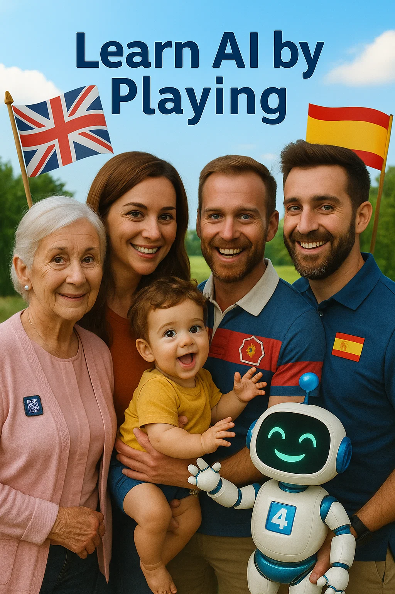

# Learn AI by Playing 🎮🤖

An educational micro‑game to explore the basics of **Artificial Intelligence (AI)** through quick quizzes, baby‑emoji feedback and playful sounds.

---

## 🌟 Features

* Bilingual interface (**English / Spanish**)
* Responsive design (desktop & mobile)
* Instant baby‑emoji + sound feedback (correct, wrong, victory)
* Short rounds (Phase 1 = 4 questions) – keeps attention
* Optional *“Need a hint?”* button powered by **GPT‑3.5 Turbo**
* Open‑source: plain **HTML / CSS / JS** – no build step

---

## 🚀 How to Use

1. **Clone or download** the repo.
2. Open **`index.html`** in any modern browser – works offline (GPT button will show a placeholder).

### Deploy on GitHub Pages

* Repo → **Settings → Pages** → Source = `main / root` → *Save*.
* Your game will be live at:
  `https://<user>.github.io/learn-ai-by-playing/`

### GPT backend (optional)

Run the tiny Flask proxy in `backend/` and update the URL in `script.js`.

---

## 🔊 / 🖼️ Assets

* **`images/`** – Baby reactions (`happy‑baby.png`, `sad‑baby.png`, `party‑baby.png`) + hero image.
* **`sounds/`** – `Vivid Beat.mp3` (loop) · `correct.*` (giggle) · `wrong.*` (whimper) · `victory.*` (fanfare).

All SFX are CC0 or AI‑generated and free of royalties.

---

## 🔗 Test Environment

Developed and tested on **Replit** free tier (server sleeps after \~1 h).  A permanent public deployment is planned for the final release.

---

## 🛠️ Technologies

* HTML, CSS, JavaScript (vanilla)
* OpenAI API (GPT‑3.5 Turbo – optional)
* SPARC‑based educational design

---

## 📷 Screenshot

---

## ✨ Author

**Toni Molina** – created for the *Let’s Build AI* course (Jersey 2025).
With support from Vincent Sider & Malcolm Mason.

> Learning AI should feel like a game of peek‑a‑boo – surprising, fun and memorable.

---

## TODO

* Phase 2: introduce Machine Learning vs rule‑based.
* Add progress bar & score.
* Accessibility audit (ARIA labels, colour contrast).
